Aristotle University of Thessaloniki\
Department of Electrical and Computer Engineering\
Telecommunications Division\

Kyrkou Sofia Eirini & Patsatzaki Evangelia \
11274 & 11330

Communication Systems II\
Seeing Signals

# Part I: IQ Signal Modeling and Dataset Construction

In this section, we present the various constellations of various
modulations asked with different types of noise and distortion.
Following that, we make a comparison between the SEP and SNR curves,
only for the QAM modulations.

## Constellations

For every modulation asked, below we will provide six figures all with
different types of noise. More specifically: the clean constellation,
with I-Q imbalance only, with jamming only, with phase noise only and
finally, two constellations with all above mixed (including amplitude
distortion) in medium and high severity. All testing parameters are
listed below every image and are selected randomly.

### 4-ASK

<figure id="Fig:Data3" data-latex-placement="H">

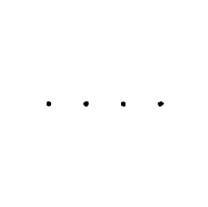

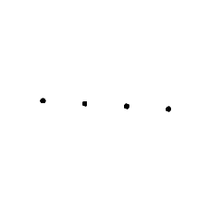

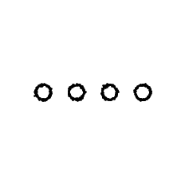

<figcaption>Jamming Only (-17.31)</figcaption>
</figure>

<figure id="Fig:Data6" data-latex-placement="H">

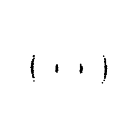

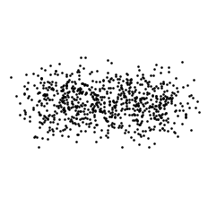

<figcaption>Mixed High 
SNR=9dB,pn=14deg,jam=-12.95,amp=0.2,iq[a,p]=[0.62,2.61]</figcaption>
</figure>

### 8-ASK

<figure id="Fig:Data3" data-latex-placement="H">

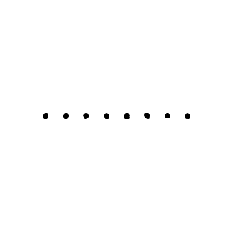

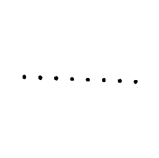

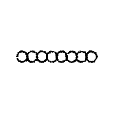

<figcaption>Jamming Only (-12.66)</figcaption>
</figure>

<figure id="Fig:Data6" data-latex-placement="H">

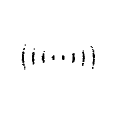

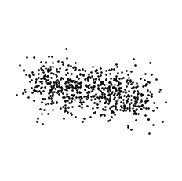

<figcaption>Mixed High 
SNR=6dB,pn=13deg,jam=-14.93,amp=0.2,iq[a,p]=[1.34,18.16]</figcaption>
</figure>

### BPSK

<figure id="Fig:Data3" data-latex-placement="H">

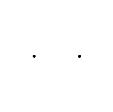

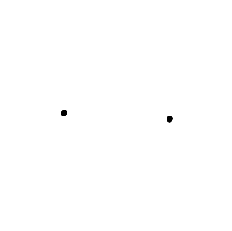

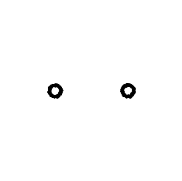

<figcaption>Jamming Only (-16)</figcaption>
</figure>

<figure id="Fig:Data6" data-latex-placement="H">

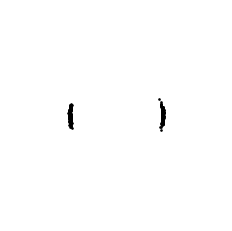

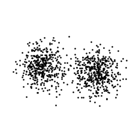

<figcaption>Mixed High 
SNR=5dB,pn=9deg,jam=-14.77,amp=0.2,iq[a,p]=[1.85,19.49]</figcaption>
</figure>

### QPSK

<figure id="Fig:Data3" data-latex-placement="H">

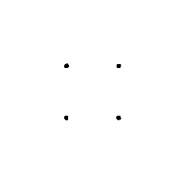

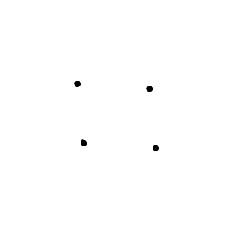

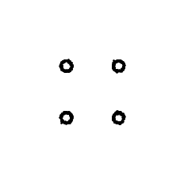

<figcaption>Jamming Only (-16.88)</figcaption>
</figure>

<figure id="Fig:Data6" data-latex-placement="H">

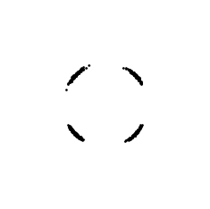

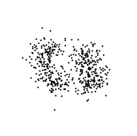

<figcaption>Mixed High 
SNR=9dB,pn=11.84deg,jam=-12.26,amp=0.2,iq[a,p]=[2.16,19.49]</figcaption>
</figure>

### 4-HQAM

<figure id="Fig:Data3" data-latex-placement="H">

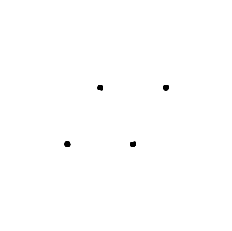

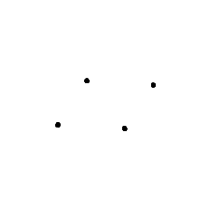

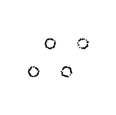

<figcaption>Jamming Only (-13.87)</figcaption>
</figure>

<figure id="Fig:Data6" data-latex-placement="H">

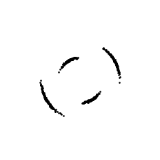

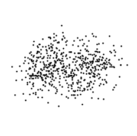

<figcaption>Mixed High 
SNR=5dB,pn=11.62deg,jam=-11.9,amp=0.2,iq[a,p]=[2.4,12.9]</figcaption>
</figure>

### 16-HQAM

<figure id="Fig:Data3" data-latex-placement="H">

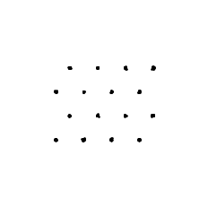

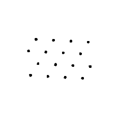

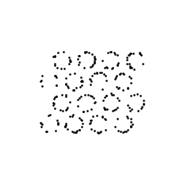

<figcaption>Jamming Only (-12.91)</figcaption>
</figure>

<figure id="Fig:Data6" data-latex-placement="H">

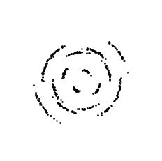

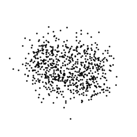

<figcaption>Mixed High 
SNR=8dB,pn=10.42deg,jam=-10.27,amp=0.2,iq[a,p]=[1.86,14.12]</figcaption>
</figure>

### 64-HQAM

<figure id="Fig:Data3" data-latex-placement="H">

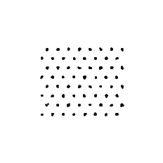

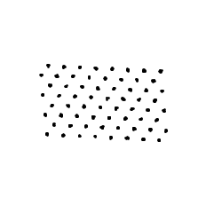

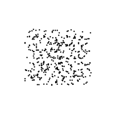

<figcaption>Jamming Only (-13.86)</figcaption>
</figure>

<figure id="Fig:Data6" data-latex-placement="H">

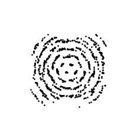

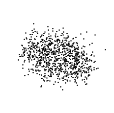

<figcaption>Mixed High 
SNR=9dB,pn=17deg,jam=-10.94,amp=0.2,iq[a,p]=[1.35,19.87]</figcaption>
</figure>

### 16-QAM

<figure id="Fig:Data3" data-latex-placement="H">

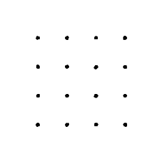

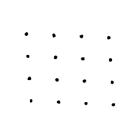

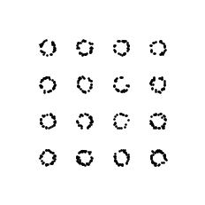

<figcaption>Jamming Only (-15.45)</figcaption>
</figure>

<figure id="Fig:Data6" data-latex-placement="H">

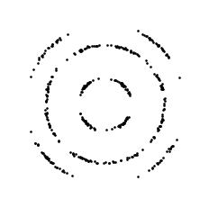

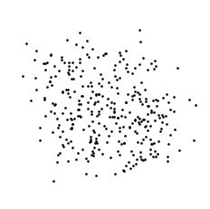

<figcaption>Mixed High 
SNR=6dB,pn=9.6deg,jam=-13.2,amp=0.2,iq[a,p]=[1.19,17.06]</figcaption>
</figure>

### 32-QAM

<figure id="Fig:Data3" data-latex-placement="H">

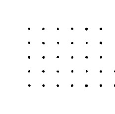

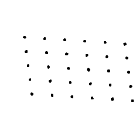

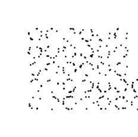

<figcaption>Jamming Only (-12.95)</figcaption>
</figure>

<figure id="Fig:Data6" data-latex-placement="H">

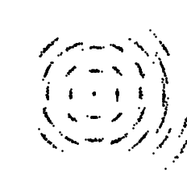

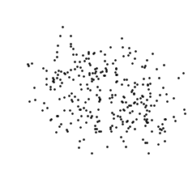

<figcaption>Mixed High 
SNR=7dB,pn=13deg,jam=-10.87,amp=0.2,iq[a,p]=[1.06.12.99]</figcaption>
</figure>

### 64-QAM

<figure id="Fig:Data3" data-latex-placement="H">

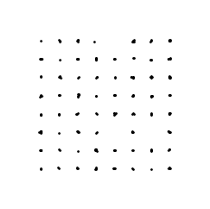

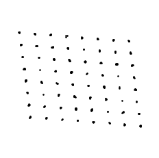

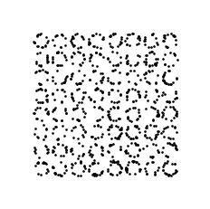

<figcaption>Jamming Only (-15.89)</figcaption>
</figure>

<figure id="Fig:Data6" data-latex-placement="H">

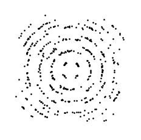

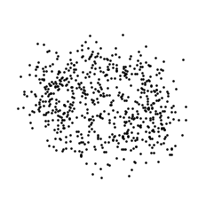

<figcaption>Mixed High 
SNR=8dB,pn=17.53deg,jam=-12.14,amp=0.2,iq[a,p]=[1.82,17.42]</figcaption>
</figure>

### 128-QAM

<figure id="Fig:Data3" data-latex-placement="H">

<figcaption>Jamming Only (-14.18)</figcaption>
</figure>

<figure id="Fig:Data6" data-latex-placement="H">

<figcaption>Mixed High 
SNR=8dB,pn=9.7deg,jam=-13.11,amp=0.2,iq[a,p]=[1.34,19.27]</figcaption>
</figure>

### 256-QAM

<figure id="Fig:Data3" data-latex-placement="H">

<figcaption>Jamming Only (-12.12)</figcaption>
</figure>

<figure id="Fig:Data6" data-latex-placement="H">

<figcaption>Mixed High 
SNR=9dB,pn=12.66deg,jam=-11.11,amp=0.2,iq[a,p]=[2.18,9.15]</figcaption>
</figure>

### 16-APSK

<figure id="Fig:Data3" data-latex-placement="H">

<figcaption>Jamming Only (-13.87)</figcaption>
</figure>

<figure id="Fig:Data6" data-latex-placement="H">

<figcaption>Mixed High 
SNR=6dB,pn=12.84deg,jam=-10.54,amp=0.2,iq[a,p]=[1.17,12.76]</figcaption>
</figure>

### 32-APSK

<figure id="Fig:Data3" data-latex-placement="H">

<figcaption>Jamming Only (-15.66)</figcaption>
</figure>

<figure id="Fig:Data6" data-latex-placement="H">

<figcaption>Mixed High 
SNR=9dB,pn=16.51deg,jam=-10.09,amp=0.2,iq[a,p]=[1.93,8.33]</figcaption>
</figure>

### 64-APSK

<figure id="Fig:Data3" data-latex-placement="H">

<figcaption>Jamming Only (-14.28)</figcaption>
</figure>

<figure id="Fig:Data6" data-latex-placement="H">

<figcaption>Mixed High 
SNR=6dB,pn=11.89deg,jam=-14.44,amp=0.2,iq[a,p]=[1.71,17.32]</figcaption>
</figure>

### 128-APSK

<figure id="Fig:Data3" data-latex-placement="H">

<figcaption>Jamming Only (-15.04)</figcaption>
</figure>

<figure id="Fig:Data6" data-latex-placement="H">

<figcaption>Mixed High 
SNR = 9dB, pn = 14.71deg 
jam = -12.61 , amp=0.2 
iq [a,p] = [1.42 , 15.07]</figcaption>
</figure>

#### General Comparison (Low vs. High Order)

::: text
\

**Observation**: A visual comparison of the constellation diagrams
reveals that susceptibility to channel impairments scales predictably
with constellation density. For low-order modulations like BPSK and
QPSK, the symbol decision boundaries remain relatively distinct even
under \"Mixed Medium\" conditions. In contrast, higher-order schemes
such as 128-QAM and 256-QAM lack the Euclidean distance between symbols
to tolerate the same variance, turning into irresolvable point clouds
under identical mixed-noise severities.
:::

#### Specific Observation on Phase Noise

::: text
\

**Observation**: The isolated phase noise figures clearly illustrate
rotational smearing. Because phase noise angularly displaces the symbol,
the absolute positional error increases with the amplitude (the distance
from the origin). This is visibly destructive in high-order
constellations like 64-QAM and 256-QAM, where the outer symbols are
smeared into overlapping rings, heavily degrading the Signal-to-Noise
Ratio (SNR) at the edges while inner symbols remain marginally more
intact.
:::

#### Specific Observation on I-Q Imbalance

::: text
\

**Observation**: The impact of I-Q imbalance isolates as a systematic
geometric skewing or rectangular stretching of the standard
constellation grid. Unlike jamming, which causes an isotropic scatter
around the ideal points, I-Q imbalance fundamentally shifts the
reference grid. When combined with other impairments in the \"Mixed
High\" scenarios, this underlying skew effectively shrinks the error
tolerance margins, making successful demodulation of dense schemes like
16-APSK nearly impossible.
:::

## SEP vs SNR curves

In this part, for different QAM modulations asked, we present the Signal
Error Probability for different SNR rates and degrees of phase noise.

### 16-QAM

<figure id="fig:16qam_sep" data-latex-placement="H">

<figcaption>SEP vs SNR for 16-QAM under AWGN conditions.</figcaption>
</figure>

### 32-QAM

<figure id="fig:32qam_sep" data-latex-placement="H">

<figcaption>SEP vs SNR for 32-QAM under AWGN conditions.</figcaption>
</figure>

#### Low-to-Medium Density (16-QAM and 32-QAM) Notes

::: text
\

**Observation**: In these lower-order modulations, the system can
tolerate moderate phase noise without failing completely. The $0^\circ$
curves perfectly track the theoretical baseline (confirming the
simulation's validity), while the $2^\circ$ and $5^\circ$ curves
maintain the characteristic \"waterfall\" shape.

**Analysis**: At $5^\circ$ of phase noise, 16-QAM suffers a roughly 3 dB
penalty at a Symbol Error Probability (SEP) of $10^{-3}$. 32-QAM shows a
sharper divergence, requiring noticeably more SNR to maintain the same
error rate.

**Conclusion**: For these schemes, phase noise acts primarily as an SNR
penalty. The system can still achieve highly reliable communications
(SEP $< 10^{-5}$) if the transmitter simply boosts its output power to
overcome the smearing effect.
:::

### 64-QAM

<figure id="fig:64qam_sep" data-latex-placement="H">

<figcaption>SEP vs SNR for 64-QAM under AWGN conditions.</figcaption>
</figure>

### 128-QAM

<figure id="fig:128qam_sep" data-latex-placement="H">

<figcaption>SEP vs SNR for 128-QAM under AWGN conditions.</figcaption>
</figure>

#### High Density (64-QAM and 128-QAM) Notes

::: text
\

**Observation**: This is where the physics of the constellation begin to
severely limit the system. In the 64-QAM plot, the $5^\circ$ phase noise
curve stops dropping and flattens out entirely around an SEP of
$10^{-1}$. In the 128-QAM plot, the $5^\circ$ curve is almost entirely
flat, and even the $2^\circ$ curve is beginning to flare out
dramatically.

**Analysis**: The flattening of these curves indicates an error floor.
An error floor occurs when the primary cause of symbol errors is no
longer thermal noise (AWGN), but the phase impairment itself.

**Conclusion**: Once an error floor is reached, increasing the
transmitter power (SNR) will no longer improve the system's performance.
A 64-QAM or 128-QAM system operating with $5^\circ$ of phase variance is
fundamentally broken and cannot achieve reliable data transfer,
regardless of how strong the signal is.
:::

### 256-QAM

<figure id="fig:256qam_sep" data-latex-placement="H">

<figcaption>SEP vs SNR for 256-QAM under AWGN conditions.</figcaption>
</figure>

#### Ultra-High Density (256-QAM) Notes

::: text
\

**Observation**: The 256-QAM plot demonstrates total system fragility in
the presence of phase instability. The $5^\circ$ curve is effectively a
flatline at an SEP of $3\times10^{-1}$ (a $30\%$ error rate). More
importantly, even the relatively small $2^\circ$ phase noise variance
creates a hard error floor near $10^{-2}$.

**Analysis**: Because 256 symbols are packed into the same normalized
power space, the distance between decision boundaries is microscopic.
The outer symbols are so far from the origin that even a $2^\circ$
rotation swings them completely out of their designated quadrants.

**Conclusion**: To successfully deploy 256-QAM (common in modern Wi-Fi
and 5G networks), the hardware must have exceptionally high-quality
local oscillators and advanced digital phase-locked loops (PLLs) to keep
phase noise strictly below $1^\circ$.
:::

# Part II: Neural Architecture Training and Evaluation

## Introduction

The objective of this section is to evaluate how effectively a
convolutional neural network (CNN) extracts communication parameters
directly from constellation geometry. This model serves as the purely
vision-based baseline, evaluating robustness and generalization under
varying impairment conditions without the use of language conditioning.
The model was tasked with predicting four structured labels: modulation
type, Signal-to-Noise Ratio (SNR) range, phase noise level, and I/Q
imbalance level.

## Modulation Classification Performance

The CNN demonstrates a strong baseline ability to extract spatial
geometry, as evidenced by the heavy dark blue diagonal in the confusion
matrix. The architecture easily separates distinct geometric boundaries,
achieving near-perfect classification for modulations with unique
spatial footprints such as 128-APSK, 32-QAM, and QPSK.

However, the model exhibits expected degradation when classifying
high-density, square QAM constellations under noisy conditions. Most
notably, the true label 64-QAM was misclassified as 256-QAM in a
significant number of instances. From a purely computer vision
perspective, the spatial difference between a noise-impaired 64-QAM grid
and a 256-QAM grid is minimal, as the individual symbol decision
boundaries blur into a continuous spatial distribution.

*Source Justification:* High-order QAM schemes are inherently
susceptible to classification errors in blind vision-based detection
because the Euclidean distance between constellation points shrinks
exponentially, causing the spatial probability density functions to
overlap heavily in the presence of AWGN (*"Digital Communications"*,
Proakis, J. G., & Salehi, M., Chapter on Baseband
Demodulation/Detection).

<figure data-latex-placement="H">

<figcaption>Modulation Classification Confusion Matrix.</figcaption>
</figure>

## SNR Range Classification

The model proved highly adept at categorizing the severity of thermal
noise. The confusion matrix shows a near-perfect diagonal with 172, 533,
and 372 correct predictions across the Low, Medium, and High SNR tiers,
respectively, with almost zero off-diagonal misclassifications.

For a convolutional architecture, thermal noise (AWGN) translates
directly to the visual variance or "spread" of the constellation
clusters. CNNs excel at detecting spatial variance and Gaussian blurring
through their pooling layers, making SNR tiering a highly optimized task
for this architecture.

<figure data-latex-placement="H">

<figcaption>SNR Level Confusion Matrix.</figcaption>
</figure>

## Phase Noise Level Classification

**Observation**: Unlike the SNR classification task, the model failed to
accurately classify the severity of Phase Noise. The confusion matrix
indicates near-random guessing and severe misclassification, with a
large portion of true 'None/Low' states predicted incorrectly as
'Medium' or 'High'. Furthermore, the validation set contained no true
'High' labels for this specific impairment, highlighting the dataset's
compound noise structure.

**Analysis**: This failure is a classic example of spatial feature
entanglement. Phase noise presents visually as rotational smearing
(circular variance). However, in the dataset's 'Medium' and 'High'
severity tiers, phase noise is compounded simultaneously with jamming
and amplitude distortion. The isotropic scatter from the jamming noise
entirely masks the circular footprint of the phase noise, making it
impossible for the CNN's spatial filters to isolate the phase variance
as an independent feature.

<figure data-latex-placement="H">

<figcaption>Phase Noise Level Confusion Matrix.</figcaption>
</figure>

## I/Q Imbalance Level Classification

**Observation**: The model exhibited total mode collapse for the I/Q
Imbalance classification task. The confusion matrix shows that the
network predicted 'None/Low (0)' for 100% of the validation samples,
completely ignoring the 'Medium' and 'High' classes regardless of the
true label.

**Analysis**: I/Q imbalance manifests as an asymmetric rectangular
stretching or skewing of the constellation grid. In isolated conditions,
CNNs can easily detect this affine transformation. However, because the
dataset design heavily compounded I/Q imbalance with severe AWGN and
jamming in the higher tiers, the decision boundaries of the
constellation points expanded into overlapping isotropic blobs. This
total destruction of the grid geometry erased the visual skewing effect.
Consequently, the network could not extract a reliable gradient for I/Q
imbalance and collapsed into predicting the majority/default class to
minimize its localized loss function.

<figure data-latex-placement="H">

<figcaption>I/Q Imbalance Level Confusion Matrix.</figcaption>
</figure>

## Robustness and Generalization Across Impairment Tiers

The model's overall classification accuracy was evaluated across three
distinct channel environment conditions to test its generalization. As
expected, accuracy drops significantly to $47.67\%$ under severe
compound impairments (Low SNR). At this level of degradation, the
constellation geometry is heavily obfuscated.

A critical anomaly is observed between the Medium and High SNR tiers.
The model achieved a peak accuracy of $99.25\%$ under Medium SNR
conditions, but accuracy dropped to $94.39\%$ under High SNR (clean)
conditions. This inversion suggests a quirk in the CNN's feature
extraction methodology. Clean, high-order QAMs consist of very tight,
microscopic visual dots, which the CNN's max-pooling layers likely lost
or suppressed. Conversely, a slightly noisy signal (Medium SNR) expands
the dots into larger Gaussian blobs that survive the convolutional
downsampling process more effectively.

*Source Justification:* Vision-based modulation classifiers frequently
experience performance inversions on perfectly clean data if the spatial
filters overfit to the Gaussian spread of the training data. The pooling
layers in CNNs act as low-pass spatial filters, which can inadvertently
suppress the high-frequency spatial components of ideal, noiseless
impulses (*"Convolutional Radio Modulation Recognition Networks"*,
O'Shea, T. J., et al., Springer).

<figure data-latex-placement="H">

<figcaption>Modulation Classification Accuracy vs. SNR / Severity
Tier.</figcaption>
</figure>

## Architecture Comparison and Computational Limitations

The final objective of this study was to compare the purely vision-based
CNN baseline against a modern Vision-Language Model (VLM), specifically
the Hugging Face *SmolVLM-256M-Instruct*. The VLM was tasked with
receiving the constellation image alongside a text prompt to generate a
descriptive textual answer identifying the modulation and channel
impairments.

To adapt the VLM, parameter-efficient fine-tuning via Low-Rank
Adaptation (LoRA) was utilized ($r=8, \alpha=16$ on the query and value
projection matrices). However, the training strategy was heavily
dictated by severe computational limitations. Standard fine-tuning of a
256-million parameter model over the full master dataset exceeded the
memory and maximum execution time thresholds of the available free-tier
hardware (Google Colab T4 GPU). To prevent kernel termination, the
dataset was aggressively downsampled to 600 training samples, and a
strict hard-cap of 60 gradient update steps was imposed.

**Quantitative Results**: The performance disparity between the two
architectures under these constraints is absolute, as shown in the
training and evaluation logs (Figure
[38](#fig:vlm_results){reference-type="ref"
reference="fig:vlm_results"}).

<figure id="fig:vlm_results" data-latex-placement="H">

<figcaption>SmolVLM Training Loss and Final Evaluation
Results.</figcaption>
</figure>

**Analysis and Conclusion**: The VLM's 0.00% accuracy is a direct
manifestation of interrupted cross-modal convergence. While the training
loss dropped significantly during the 60 steps (from 19.56 to 1.77),
indicating the LoRA adapters were successfully learning the semantic
syntax and structure of the textual responses, the model lacked the
compute time required to map the spatial RF features from its vision
encoder to the correct semantic tokens in the language model.
Consequently, it failed to output the exact modulation classifications.

Conversely, the CNN was highly specialized. Because it did not have to
dedicate millions of parameters to natural language generation, it could
dedicate 100% of its computational budget to spatial feature extraction,
achieving high accuracy in minutes.

Ultimately, this comparison highlights a critical engineering trade-off:
while VLMs offer incredible flexibility and language-conditioned
generalization, they require massive compute clusters to align their
visual and textual latent spaces. For edge-device deployment or rapid RF
parameter extraction under constrained resources, custom lightweight
CNNs remain vastly superior in both robustness and computational
efficiency.

::: thebibliography
9

J. G. Proakis and M. Salehi, *Digital Communications*, 5th ed. New York,
NY, USA: McGraw-Hill Education, 2007.

M. C. Jeruchim, P. Balaban, and K. S. Shanmugan, *Simulation of
Communication Systems: Modeling, Methodology and Techniques*, 2nd ed.
New York, NY, USA: Springer, 2000.

B. Sklar, *Digital Communications: Fundamentals and Applications*, 2nd
ed. Upper Saddle River, NJ, USA: Prentice Hall, 2001.

T. J. O'Shea, J. Corgan, and T. C. Clancy, "Convolutional radio
modulation recognition networks," in *Engineering Applications of Neural
Networks*. Cham, Switzerland: Springer, 2016, pp. 213--226.

D. Cai, Y. Xu, F. Fang, Z. Ding, and P. Fan, "On the impact of
time-correlated fading for downlink NOMA," *IEEE Transactions on
Communications*, vol. 67, no. 6, pp. 4491--4504, 2019.

H. Zou, Y. Tian, B. Wang, L. Bariah, S. Lasaulce, C. Huang, and M.
Debbah, "RF-GPT: Teaching AI to See the Wireless World," *arXiv preprint
arXiv:2404.14818*, 2024.

T. K. Oikonomou et al., "CNN-Based Automatic Modulation Classification
Under Phase Imperfections," *IEEE Wireless Communications Letters*, vol.
13, no. 5, pp. 1508--1512, May 2024.

"Convolutional neural network," Wikipedia. \[Online\]. Available:
<https://en.wikipedia.org/wiki/Convolutional_neural_network>.
:::
