Aristotle University of Thessaloniki\
Department of Electrical and Computer Engineering\
Telecommunications Division\

Evangelia Patsatzaki & Sofia Eirini Kyrkou \
11330 & 11274

Communication Systems II\
Seeing Signals

# Part I: IQ Signal Modeling and Dataset Construction

In this section, we present the various constellations of various
modulations asked with different types of noise and distortion.
Following that, we make a comparison between the SEP and SNR curves,
only for the QAM modulations.

## Constellations

For every modulation asked, below we will provide six figures all with
different types of noise. More specifically: the clean constellation,
with I-Q imbalance only, with jamming only (specifically Single-Tone
Continuous Wave Jamming), with phase noise only and finally, two
constellations with all above mixed (including amplitude distortion) in
medium and high severity. All testing parameters are listed below every
image and are selected randomly.

### 4-ASK

<figure id="Fig:Data3" data-latex-placement="H">

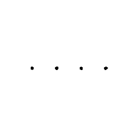

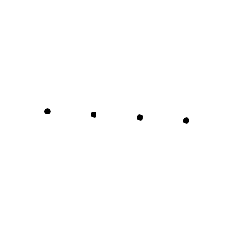

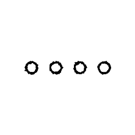

<figcaption>Jamming Only (-17.31)</figcaption>
</figure>

<figure id="Fig:Data6" data-latex-placement="H">

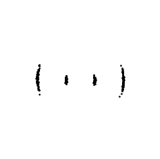

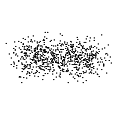

<figcaption>Mixed High 
SNR=9dB,pn=14deg,jam=-12.95,amp=0.2,iq[a,p]=[0.62,2.61]</figcaption>
</figure>

### 8-ASK

<figure id="Fig:Data3" data-latex-placement="H">

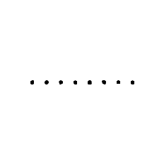

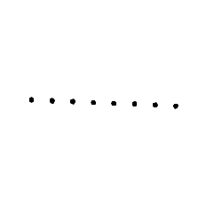

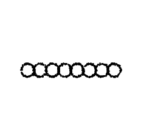

<figcaption>Jamming Only (-12.66)</figcaption>
</figure>

<figure id="Fig:Data6" data-latex-placement="H">

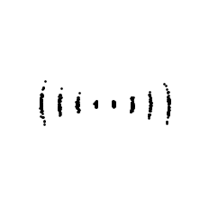

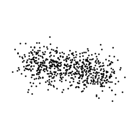

<figcaption>Mixed High 
SNR=6dB,pn=13deg,jam=-14.93,amp=0.2,iq[a,p]=[1.34,18.16]</figcaption>
</figure>

### BPSK

<figure id="Fig:Data3" data-latex-placement="H">

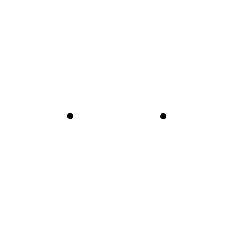

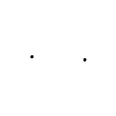

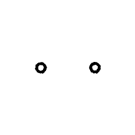

<figcaption>Jamming Only (-16)</figcaption>
</figure>

<figure id="Fig:Data6" data-latex-placement="H">

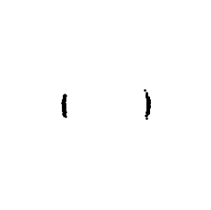

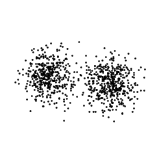

<figcaption>Mixed High 
SNR=5dB,pn=9deg,jam=-14.77,amp=0.2,iq[a,p]=[1.85,19.49]</figcaption>
</figure>

### QPSK

<figure id="Fig:Data3" data-latex-placement="H">

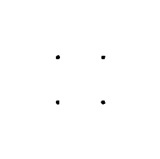

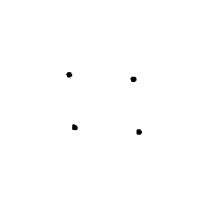

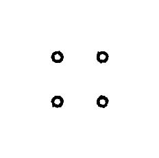

<figcaption>Jamming Only (-16.88)</figcaption>
</figure>

<figure id="Fig:Data6" data-latex-placement="H">

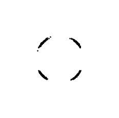

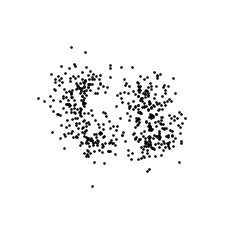

<figcaption>Mixed High 
SNR=9dB,pn=11.84deg,jam=-12.26,amp=0.2,iq[a,p]=[2.16,19.49]</figcaption>
</figure>

### 4-HQAM

<figure id="Fig:Data3" data-latex-placement="H">

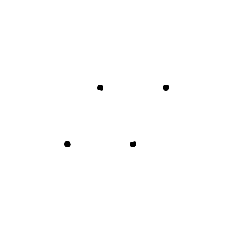

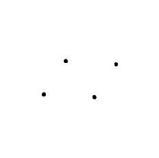

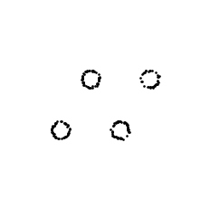

<figcaption>Jamming Only (-13.87)</figcaption>
</figure>

<figure id="Fig:Data6" data-latex-placement="H">

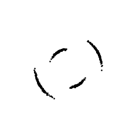

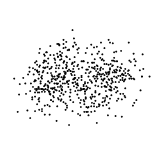

<figcaption>Mixed High 
SNR=5dB,pn=11.62deg,jam=-11.9,amp=0.2,iq[a,p]=[2.4,12.9]</figcaption>
</figure>

### 16-HQAM

<figure id="Fig:Data3" data-latex-placement="H">

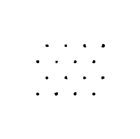

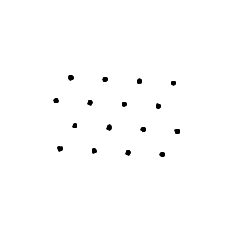

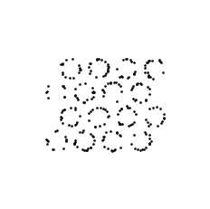

<figcaption>Jamming Only (-12.91)</figcaption>
</figure>

<figure id="Fig:Data6" data-latex-placement="H">

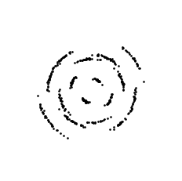

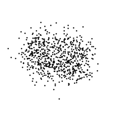

<figcaption>Mixed High 
SNR=8dB,pn=10.42deg,jam=-10.27,amp=0.2,iq[a,p]=[1.86,14.12]</figcaption>
</figure>

### 64-HQAM

<figure id="Fig:Data3" data-latex-placement="H">

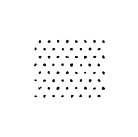

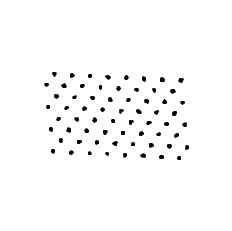

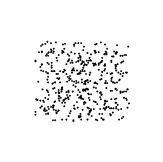

<figcaption>Jamming Only (-13.86)</figcaption>
</figure>

<figure id="Fig:Data6" data-latex-placement="H">

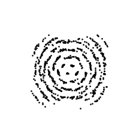

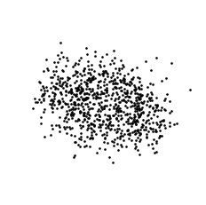

<figcaption>Mixed High 
SNR=9dB,pn=17deg,jam=-10.94,amp=0.2,iq[a,p]=[1.35,19.87]</figcaption>
</figure>

### 16-QAM

<figure id="Fig:Data3" data-latex-placement="H">

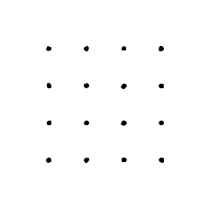

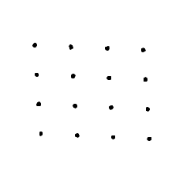

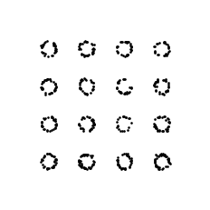

<figcaption>Jamming Only (-15.45)</figcaption>
</figure>

<figure id="Fig:Data6" data-latex-placement="H">

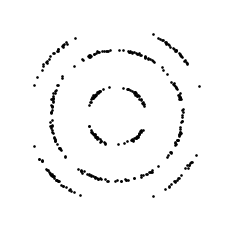

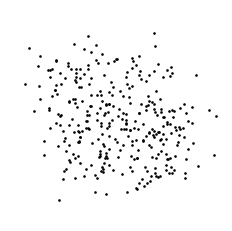

<figcaption>Mixed High 
SNR=6dB,pn=9.6deg,jam=-13.2,amp=0.2,iq[a,p]=[1.19,17.06]</figcaption>
</figure>

### 32-QAM

<figure id="Fig:Data3" data-latex-placement="H">

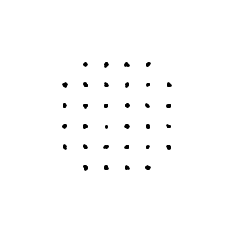

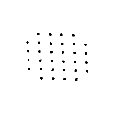

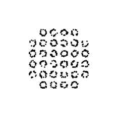

<figcaption>Jamming Only (-12.95)</figcaption>
</figure>

<figure id="Fig:Data6" data-latex-placement="H">

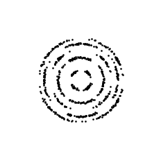

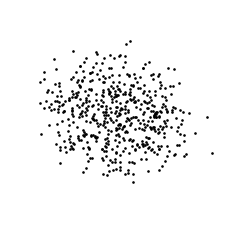

<figcaption>Mixed High 
SNR=7dB,pn=13deg,jam=-10.87,amp=0.2,iq[a,p]=[1.06.12.99]</figcaption>
</figure>

### 64-QAM

<figure id="Fig:Data3" data-latex-placement="H">

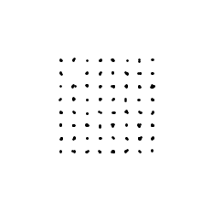

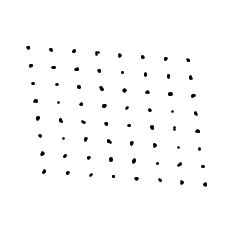

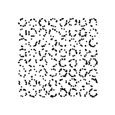

<figcaption>Jamming Only (-15.89)</figcaption>
</figure>

<figure id="Fig:Data6" data-latex-placement="H">

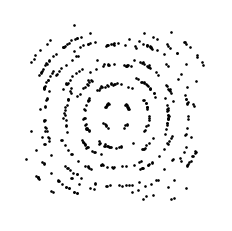

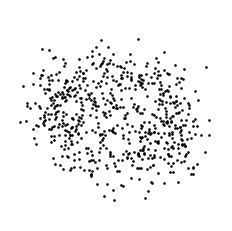

<figcaption>Mixed High 
SNR=8dB,pn=17.53deg,jam=-12.14,amp=0.2,iq[a,p]=[1.82,17.42]</figcaption>
</figure>

### 128-QAM

<figure id="Fig:Data3" data-latex-placement="H">

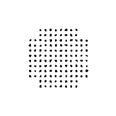

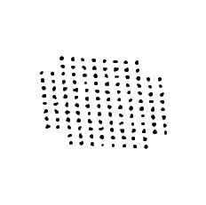

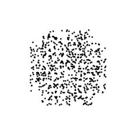

<figcaption>Jamming Only (-14.18)</figcaption>
</figure>

<figure id="Fig:Data6" data-latex-placement="H">

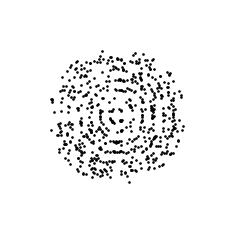

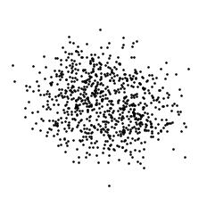

<figcaption>Mixed High 
SNR=8dB,pn=9.7deg,jam=-13.11,amp=0.2,iq[a,p]=[1.34,19.27]</figcaption>
</figure>

### 256-QAM

<figure id="Fig:Data3" data-latex-placement="H">

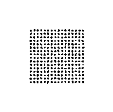

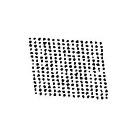

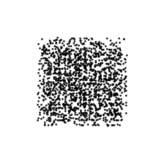

<figcaption>Jamming Only (-12.12)</figcaption>
</figure>

<figure id="Fig:Data6" data-latex-placement="H">

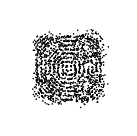

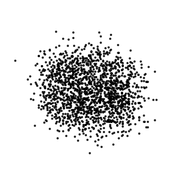

<figcaption>Mixed High 
SNR=9dB,pn=12.66deg,jam=-11.11,amp=0.2,iq[a,p]=[2.18,9.15]</figcaption>
</figure>

### 16-APSK

<figure id="Fig:Data3" data-latex-placement="H">

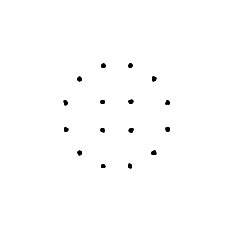

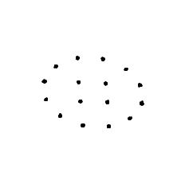

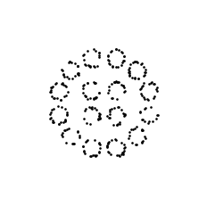

<figcaption>Jamming Only (-13.87)</figcaption>
</figure>

<figure id="Fig:Data6" data-latex-placement="H">

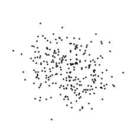

<figcaption>Mixed High 
SNR=6dB,pn=12.84deg,jam=-10.54,amp=0.2,iq[a,p]=[1.17,12.76]</figcaption>
</figure>

### 32-APSK

<figure id="Fig:Data3" data-latex-placement="H">

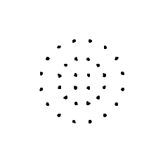

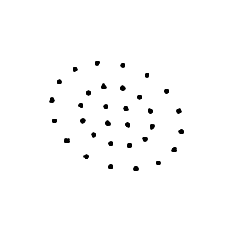

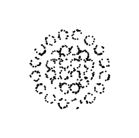

<figcaption>Jamming Only (-15.66)</figcaption>
</figure>

<figure id="Fig:Data6" data-latex-placement="H">

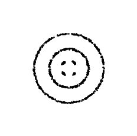

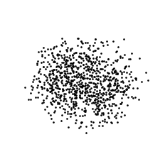

<figcaption>Mixed High 
SNR=9dB,pn=16.51deg,jam=-10.09,amp=0.2,iq[a,p]=[1.93,8.33]</figcaption>
</figure>

### 64-APSK

<figure id="Fig:Data3" data-latex-placement="H">

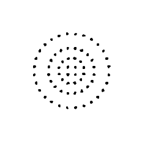

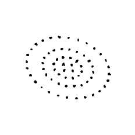

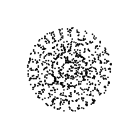

<figcaption>Jamming Only (-14.28)</figcaption>
</figure>

<figure id="Fig:Data6" data-latex-placement="H">

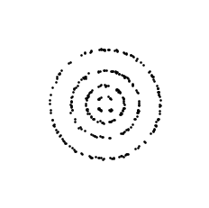

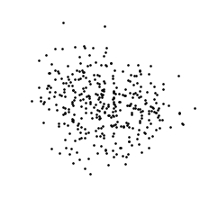

<figcaption>Mixed High 
SNR=6dB,pn=11.89deg,jam=-14.44,amp=0.2,iq[a,p]=[1.71,17.32]</figcaption>
</figure>

### 128-APSK

<figure id="Fig:Data3" data-latex-placement="H">

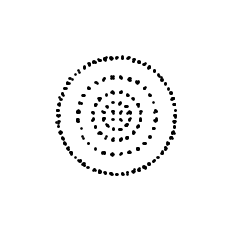

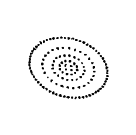

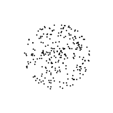

<figcaption>Jamming Only (-15.04)</figcaption>
</figure>

<figure id="Fig:Data6" data-latex-placement="H">

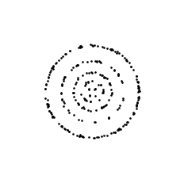

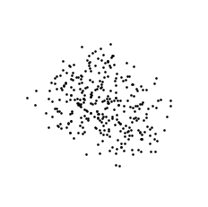

<figcaption>Mixed High 
SNR = 9dB, pn = 14.71deg 
jam = -12.61 , amp=0.2 
iq [a,p] = [1.42 , 15.07]</figcaption>
</figure>

### Comments regarding the modulation of the constellations

::: text
\

**Number of symbols used**: For the 256-QAM constellation, we used a
random selection between 1500-1700 symbols for the modulation of each
constellation, compared to a random selection of 200-1000 we used for
the rest. This serves the purpose of making the full constellation
visible and not having gaps.\

**Number of constellations created vs shown**: Each constellation shown
above, was a random choice of 60 constellations created, each of them
containing a random number of symbols. This choice was made to produce
enough samples for training of CNN and VLM, for part II. Admittedly, we
could also have added more variety for noisy modulations, however that
did not seem to cause a problem later on.\

**Single-Tone Continuous Wave Jamming**: In the modulations with
jamming, we experimented with Single-Tone CW Jamming. AWGN jamming would
have added a random and messy distortion, and it would have been great
to see how the CNN and VLM react to it alone. However, we did have Mixed
Medium and Mixed High signals, with distortion coming for the most part
from AWGN. This was the reason we decided to test a more structured
jamming distortion instead.\

**Readability in high distortions**: Visually, we can conclude that for
lower-order modulations (like BPSK and QPSK), the symbol decision
boundaries remain relatively distinct even in \"Mixed Medium\"
conditions. However, higher-order modulations (like 128-QAM and 256-QAM)
seem to be a lot more complicated even in \"Mixed Medium\" conditions.
This might also be caused by the size of the image, which makes it more
difficult to understand whether a constellation is \"readable\" using
MLD or similar techniques.\

**Readability with phase noise**: It is also clear that phase noise
mostly influences (negatively) M-APSK and higher-order modulations. As
mentioned before regarding the higher-order modulations, we cannot know
for sure that the size of the image does not influence the visible
result.\

**Readability with I/Q Imbalance**: Regarding I/Q imbalance, it is
visible that it creates a geometric skewing and scaling of the axes
compared to the clear modulation, but it is still visually readable. If
the demodulator knows how big the I/Q imbalance is, it can apply a
compensation matrix to rI and rQ and get the correct symbols.
:::

## SEP vs SNR curves

In this part, for different QAM modulations asked, we present the Signal
Error Probability for different SNR rates and degrees of phase noise.

### 16-QAM

<figure id="fig:16qam_sep" data-latex-placement="H">
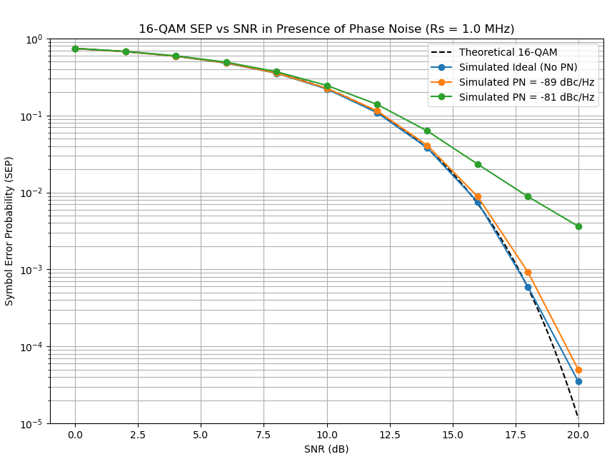
<figcaption>SEP vs SNR for 16-QAM under AWGN conditions.</figcaption>
</figure>

### 32-QAM

<figure id="fig:32qam_sep" data-latex-placement="H">
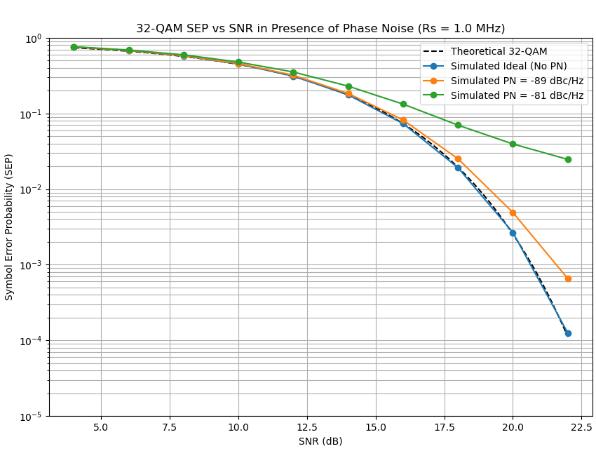
<figcaption>SEP vs SNR for 32-QAM under AWGN conditions.</figcaption>
</figure>

#### Low-to-Medium Density (16-QAM and 32-QAM) Notes

::: text
\

**Observation**: In these lower-order modulations, the system can
tolerate moderate phase noise without failing completely. The no-PN
curves perfectly track the theoretical ideal curve (confirming the
simulation's validity), while the -89dBc/Hz and -81dBc/Hz curves seem to
continue falling as SNR gets bigger.

**Analysis**: At -81dBc/Hz of phase noise, 16-QAM suffers a roughly 3 dB
penalty at a Symbol Error Probability (SEP) of $5*10^{-3}$. 32-QAM shows
a sharper slope, requiring much more SNR to maintain the same error
rate.

**Conclusion**: For these constellations, phase noise acts mostly as an
SNR penalty (trade-off condition). The system can still achieve highly
reliable communications (SEP $< 10^{-3}$) if the transmitter simply
boosts its output power to overcome the smearing effect.
:::

### 64-QAM

<figure id="fig:64qam_sep" data-latex-placement="H">
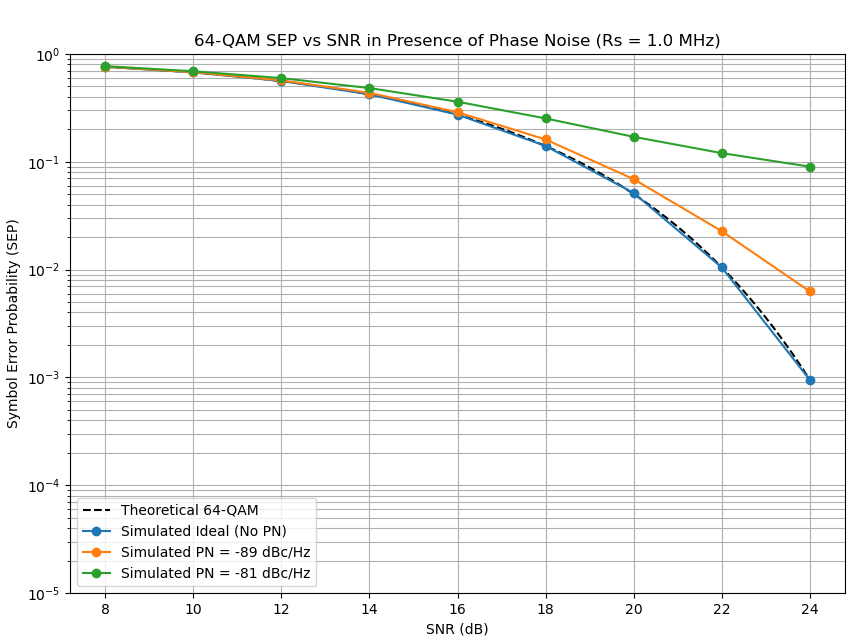
<figcaption>SEP vs SNR for 64-QAM under AWGN conditions.</figcaption>
</figure>

### 128-QAM

<figure id="fig:128qam_sep" data-latex-placement="H">
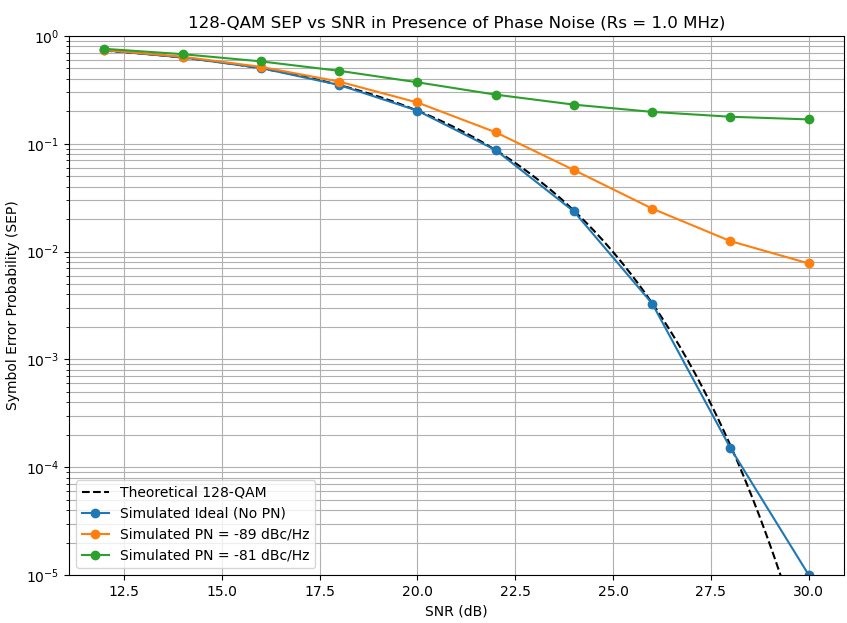
<figcaption>SEP vs SNR for 128-QAM under AWGN conditions.</figcaption>
</figure>

#### High Density (64-QAM and 128-QAM) Notes

::: text
\

**Observation**: This is where the physics of the constellation begin to
severely limit the system. In the 64-QAM plot, the -81dBc/Hz phase noise
curve stops dropping and flattens out entirely around an SEP of
$10^{-1}$. In the 128-QAM plot, the -81dBc/Hz curve is almost entirely
flat, and even the -89dBc/Hz curve is beginning to flare out
dramatically.

**Analysis**: The flattening of these curves indicates an error floor.
An error floor occurs when the primary cause of symbol errors is no
longer AWGN, but the phase noise.

**Conclusion**: Once an error floor is reached, increasing the
transmitter power (SNR) will no longer improve the system's performance.
A 64-QAM or 128-QAM system operating with 81dBc/Hz of phase noise cannot
achieve reliable data transfer, regardless of SNR values.
:::

### 256-QAM

<figure id="fig:256qam_sep" data-latex-placement="H">
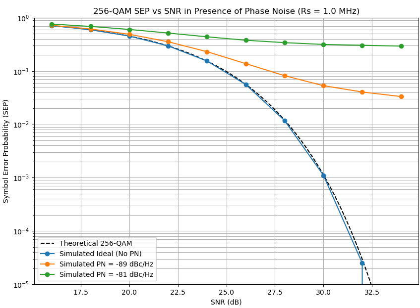
<figcaption>SEP vs SNR for 256-QAM under AWGN conditions.</figcaption>
</figure>

#### Very High Density (256-QAM) Notes

::: text
\

**Observation**: In the 256-QAM plot it is clearly visible that phase
noise of either -81dBc/Hz or -89dBc/Hz seems to flatten out the curve at
the very start. This shows that our system is very fragile in the
presence of this much phase noise. The -81dBc/Hz curve is a flatline at
an SEP of $3\times10^{-1}$ (a $30\%$ error rate). In addition, even the
smaller -89dBc/Hz phase noise variance creates an error floor near
$5\times10^{-2}$.

**Analysis**: Because 256 symbols are packed into the same normalized
power space, the distance between decision boundaries is very small.
This results in -89dBc/Hz PN to put them completely out of their
designated quadrants.

**Conclusion**: To successfully demodulate 256-QAM (common in modern
Wi-Fi and 5G networks), the hardware must have high-quality local
oscillators and advanced digital phase-locked loops (PLLs) for great
carrier synchronization to keep phase noise strictly well below
-95.16dBc/Hz.
:::

# Part II: Neural Architecture Training and Evaluation

## Introduction

The objective of this section is to evaluate how effectively a
convolutional neural network (CNN) extracts communication parameters
directly from constellation geometry. This model uses a purely
vision-based baseline, basically evaluating generalization under varying
impairment conditions without the use of language conditioning (in
contrast to VLMs). The model was tasked with predicting four structured
labels: modulation type, Signal-to-Noise Ratio (SNR) range, phase noise
level, and I/Q imbalance level.

## Modulation Classification Performance

The CNN seems to have a strong baseline ability to extract spatial
geometry, as shown by the heavy dark blue diagonal in the confusion
matrix. The architecture successfully separates distinct geometric
boundaries and achieves great classification for modulations with unique
spatial features such as 128-APSK, 32-QAM, and QPSK.

<figure data-latex-placement="H">
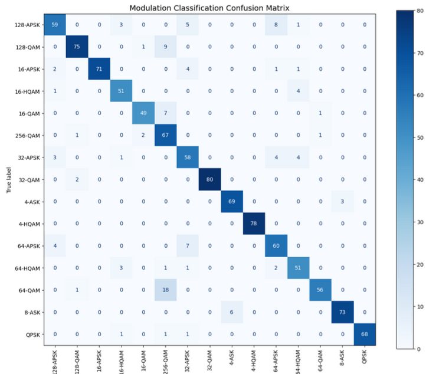
<figcaption>Modulation Classification Confusion Matrix.</figcaption>
</figure>

## SNR Range Classification

The model proved successfull at categorizing the severity of thermal
(AWG) noise. The confusion matrix shows a near-perfect diagonal with
172, 533, and 372 correct predictions across the Low, Medium, and High
SNR tiers, respectively, with almost zero off-diagonal
misclassifications.

For a convolutional architecture, thermal noise (AWGN) translates
directly to the visual variance or "spread" of the constellation
clusters. CNNs are very good at detecting spatial variance and Gaussian
blurring through their pooling layers, making SNR chategorization a
highly optimized task for this architecture.

<figure data-latex-placement="H">
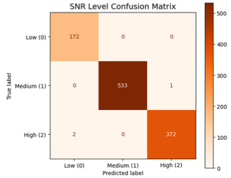
<figcaption>SNR Level Confusion Matrix.</figcaption>
</figure>

## Phase Noise Level Classification

**Observation**: Unlike the SNR classification task, the model failed to
accurately classify the severity of Phase Noise. The confusion matrix
indicates random-like guessing and severe misclassification, with a
large portion of true 'None/Low' states predicted incorrectly as
'Medium' or 'High'. Furthermore, the validation set contained no true
'High' labels for this specific impairment, highlighting the dataset's
compound noise structure.

**Analysis**: This failure is probably a result of spatial feature
entanglement. Phase noise presents visually as rotational smearing
(circular variance). However, in the dataset's 'Medium' and 'High'
severity tiers, phase noise is compounded simultaneously with jamming
and amplitude distortion. The isotropic scatter from the jamming noise
entirely masks the circular footprint of the phase noise, making it
impossible for the CNN's spatial filters to isolate the phase variance
as an independent feature.

<figure data-latex-placement="H">
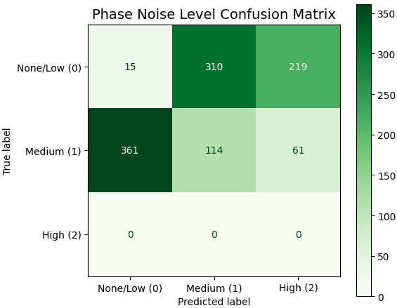
<figcaption>Phase Noise Level Confusion Matrix.</figcaption>
</figure>

## I/Q Imbalance Level Classification

**Observation**: The model exhibited total mode collapse for the I/Q
Imbalance classification task. The confusion matrix shows that the
network predicted 'None/Low (0)' for 100% of the validation samples,
completely ignoring the 'Medium' and 'High' classes regardless of the
true label.

**Analysis**: I/Q imbalance shows as an asymmetric rectangular
stretching or skewing of the constellation grid. In isolated conditions,
CNNs can easily detect this affine transformation. However, because the
dataset design heavily compounded I/Q imbalance with severe AWGN and
jamming in the higher tiers, the decision boundaries of the
constellation points expanded into overlapping isotropic blobs. This
total destruction of the grid geometry erased the visual skewing effect.
Consequently, the network could not extract a reliable gradient for I/Q
imbalance and collapsed into predicting the majority/default class to
minimize its localized loss function.

<figure data-latex-placement="H">
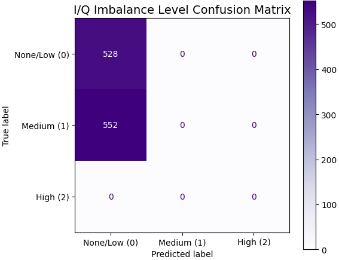
<figcaption>I/Q Imbalance Level Confusion Matrix.</figcaption>
</figure>

## Modulation Classification Accuracy Across SNR Tiers

To evaluate how well the model generalizes, it was tested on three
different SNR conditions: Low, Medium, and High. As expected, the
accuracy at Low SNR drops significantly, since the constellations are
heavily distorted and many classes start to overlap.

The interesting part appears between the Medium and High SNR tiers. Even
though High SNR represents the cleanest scenario, the model actually
performs slightly better at Medium SNR. In the results, Medium SNR
reached around 99%, while High SNR stayed closer to 95--96%.

We concluded that this happened because CNNs do not always work best
with perfectly clean constellations. At Medium SNR, the points have a
small amount of Gaussian spread, which makes the clusters look slightly
larger and smoother. These shapes are easier for the convolutional
layers to detect and preserve through pooling. In contrast, High-SNR
constellations contain very sharp and tiny point clusters, and some of
this fine detail is lost during downsampling, which reduces the amount
of useful information the network can extract.

During experimentation, it also became clear that the augmentation
pipeline affects this behavior. When stronger augmentations were used
(such as rotation, blur, or translation), the High-SNR accuracy dropped
further because these transformations distorted the clean cluster shapes
too much. After switching back to a mild, noise-based augmentation, the
High-SNR performance returned to the expected level. This shows that the
model is sensitive to how "spread out" the clusters appear, and that the
augmentation needs to match the natural structure of the data.

This pattern is also mentioned in earlier work on image-based modulation
recognition, where CNNs tend to rely more on the overall spatial
footprint of the clusters rather than their exact pixel-level details.

(O'Shea et al., "Convolutional Radio Modulation Recognition Networks,"
Springer)

<figure data-latex-placement="H">
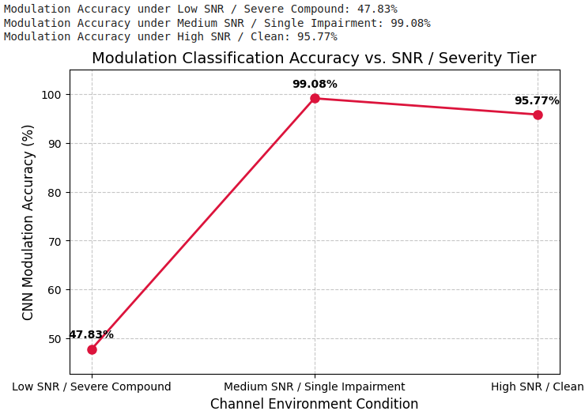
<figcaption>Modulation Classification Accuracy vs. SNR / Severity
Tier.</figcaption>
</figure>

## Architecture Comparison and Computational Limitations

The final objective of this study was to compare the purely vision-based
CNN baseline against a modern Vision-Language Model (VLM), specifically
the Hugging Face *SmolVLM-256M-Instruct*. The VLM was tasked with
receiving the constellation image alongside a text prompt to generate a
descriptive textual answer identifying the modulation and channel
impairments.

To adapt the VLM, parameter-efficient fine-tuning via Low-Rank
Adaptation (LoRA) was utilized ($r=16, \alpha=32$ on the query and value
projection matrices). However, the training strategy was heavily
dictated by severe computational limitations. Standard fine-tuning of a
256-million parameter model over the full master dataset exceeded the
memory and maximum execution time thresholds of the available free-tier
hardware (Google Colab T4 GPU). To prevent kernel termination, the
dataset was aggressively downsampled to 600 training samples, and a
strict hard-cap of 60 gradient update steps was imposed.

**Quantitative Results**: The performance disparity between the two
architectures under these constraints is absolute, as shown in the
training and evaluation logs (Figure
[38](#fig:vlm_results){reference-type="ref"
reference="fig:vlm_results"}).

<figure id="fig:vlm_results" data-latex-placement="H">
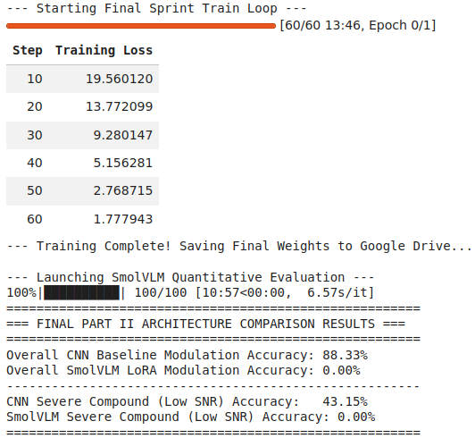
<figcaption>SmolVLM Training Loss and Final Evaluation
Results.</figcaption>
</figure>

**Evaluation and Pipeline Limitations During the evaluation phase**: The
fine-tuned model yielded a 0.00% validation accuracy. Diagnostic testing
revealed that the model was outputting empty strings (\" \") rather than
incorrect classifications. Because even an untrained base language model
will conditionally generate hallucinated text rather than blank space,
this indicates a mechanical disconnect in the token generation pipeline
rather than a failure of the model to learn weight representations.

The most probable cause is an error in the target masking function
during data collation. If the -100 ignore index masks the target JSON
answer alongside the user prompt, the model minimizes its loss by
learning to immediately output an End-Of-Sequence (EOS) token, resulting
in a mute model. Due to strict constraints on Google Colab compute units
and time limitations, further iterations to debug the dataset
tokenization length and re-run the multi-hour training epochs were not
feasible. Therefore, the 0% accuracy is accepted as a build output
rather than a true reflection of the model's theoretical capability.

In CNN, we don't have this problem of language to image matching, as it
is a non-language model. In addition, CNN is highly specialized. Because
it did not have to dedicate millions of parameters to natural language
generation, it could dedicate 100% of its computational budget to
spatial feature extraction, achieving high accuracy in minutes.

As a result, CNN was great predicting the constellations, while we
weren't able to succeed in making the VLM work. As already mentioned,
limitation in time and free-tier hardware didn't allow us to investigate
or debug further.

It is also worth noticing that the image uploaded for the VLM training
and evaluation in this final report is the result of our first tries on
making the VLMs work. The reason we decided on not updating it was
because in later versions the training was much bigger and took on too
make epochs and steps per epoch, even though the result was the same.
However, both the code used for the image shown and the code used to
re-train the VLMs is available in the GitHub.

# Code Availability

The complete source code and dataset documentation developed for this
project are available on GitHub:

<https://github.com/Epatsatzaki/Communication-Systems-Project>

The codebase is modularized into two distinct environments to ensure
reproducibility:

- **Part I Folder (Local Python Environment):** Contains the fundamental
  RF physics engine (`signal_engine.py`), dataset generation scripts
  (`dataset_generator.py`), and metadata formatting tools used to
  synthesize the baseband constellations.

- **Part II File (Google Colab):** Contains the PyTorch Jupyter
  notebooks utilized for the Convolutional Neural Network training and
  the parameter-efficient fine-tuning (LoRA) of the SmolVLM
  architecture. As explained in the previous section, VLM training and
  evaluation is done twice, once in (`CNN_VLM`) file (the first try on
  making the VLM work) and once in (`VLM_final`) (the last try to make
  the VLM work).

# Bibliography

J. G. Proakis and M. Salehi, *Digital Communications*, 5th ed. New York,
NY, USA: McGraw-Hill Education, 2007.

M. C. Jeruchim, P. Balaban, and K. S. Shanmugan, *Simulation of
Communication Systems: Modeling, Methodology and Techniques*, 2nd ed.
New York, NY, USA: Springer, 2000.

B. Sklar, *Digital Communications: Fundamentals and Applications*, 2nd
ed. Upper Saddle River, NJ, USA: Prentice Hall, 2001.

T. J. O'Shea, J. Corgan, and T. C. Clancy, "Convolutional radio
modulation recognition networks," in *Engineering Applications of Neural
Networks*. Cham, Switzerland: Springer, 2016, pp. 213--226.

H. Zou, Y. Tian, B. Wang, L. Bariah, S. Lasaulce, C. Huang, and M.
Debbah, "RF-GPT: Teaching AI to See the Wireless World," *arXiv preprint
arXiv:2404.14818*, 2024.

T. K. Oikonomou et al., "CNN-Based Automatic Modulation Classification
Under Phase Imperfections," *IEEE Wireless Communications Letters*, vol.
13, no. 5, pp. 1508--1512, May 2024.

J. Rewienski, M. Groth, L. Kulas, and K. Nyka, "Investigation of
continuous wave jamming in an IEEE 802.15.4 network," in *2018 22nd
International Microwave and Radar Conference (MIKON)*, Poznan, Poland,
2018, pp. 242--246.

Rene Y. Choi, Aaron S. Coyner, Jayashree Kalpathy-Cramer, Michael F.
Chiang, J. Peter Campbell , "Introduction to Machine Learning, Neural
Networks, and Deep Learning "
<https://tvst.arvojournals.org/article.aspx?articleid=2762344>.
